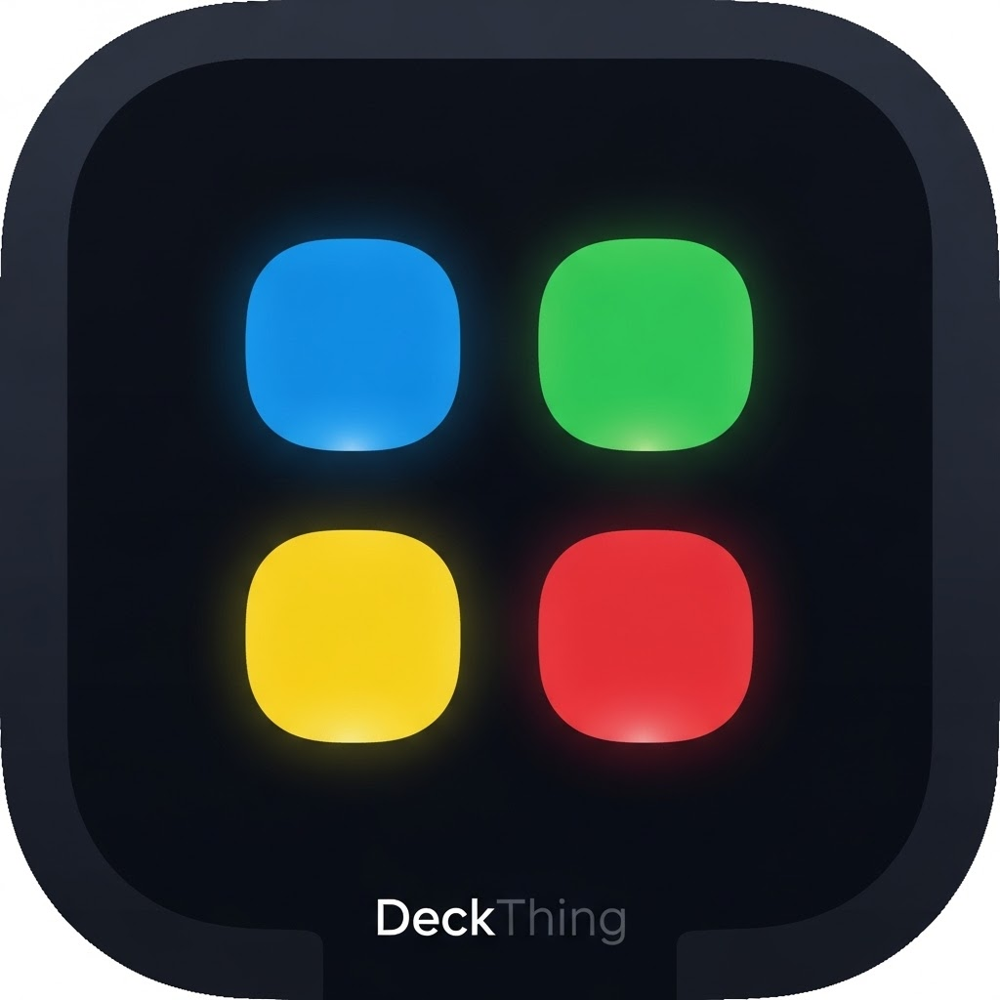

<div align="center">

**Read this in other languages:** [English](README.md) | [Türkçe](README.tr.md)



# **DeckThing**

</div>

Wire buttons to an Arduino, then map each one to text, a hotkey, or a script from a web dashboard.

> [!WARNING]
> DeckThing simulates keystrokes in software and **will be detected by most anti-cheat systems**. Using it in online or competitive games may get your account banned. It is meant for productivity, streaming, single-player, and simulator use.

> [!NOTE]
> Alpha software under active development. If something breaks, [open an issue](https://github.com/tcandrn/DeckThing-release/issues).
>
> DeckThing runs entirely on your local network and never connects to the internet. Windows may ask you to allow local network access; the dashboard needs it to reach the server.

## **How It Works**

1. **Firmware (C++)** scans the Arduino pins and sends `BTN_x` over serial when a button is pressed.
2. **Server (Node.js)** reads the serial port, hosts the dashboard and a Socket.IO API, and looks up what each button should do.
3. **Engine (Python)** performs the keystrokes through the Windows API.

The dashboard talks to the server over WebSockets, so you can swap in your own frontend or drive it from another device on your network.

## **Hardware**

- **Board:** Arduino Uno R3, Nano, Mini, Micro, or Leonardo
- **Buttons:** tactile push buttons or Cherry MX switches
- **Wiring:** two jumper wires per button, no resistors needed

## **Wiring**

Internal pull-ups are enabled, so each button needs one wire to a pin and one to ground. No resistors:

```
Arduino Pin 2 ──── [Button 1] ──── GND
Arduino Pin 3 ──── [Button 2] ──── GND
Arduino Pin A0 ──── [Button 3] ──── GND
```

Supported pins are `2-13` and `A0-A5` on Uno, Nano, and Mini, or `2-16` and `A0-A5` on Micro and Leonardo. Any supported pin works, and buttons do not need to be contiguous.

Upload `firmware/firmware.ino`, then press a button. The dashboard registers each button the first time it sees one.

The firmware sends `BTN_` followed by the Arduino pin number, so pin 2 arrives as `BTN_2`. Analog pins use their numeric equivalents: `A0-A5` are `14-19` on Uno, Nano, and Mini, and `18-23` on Micro and Leonardo.

## **Install**

Download the installer from the [Releases](https://github.com/tcandrn/DeckThing-release/releases) page and run it. Nothing else is needed: the macro engine is bundled, so Python does not have to be installed.

The installer is not code signed, so Windows SmartScreen will warn about an unrecognised publisher. Choose More info, then Run anyway.

### **Build from source**

Requires Node.js 22.12 or newer, because Electron 43 does, and Python between 3.10 and 3.14. PyInstaller does not yet support 3.15.

```bash
git clone https://github.com/tcandrn/DeckThing-release.git
cd DeckThing-release
npm install
npm run setup:python
```

A single `npm install` from the root covers the dashboard, the server, and the Electron tooling.

Python is located automatically by trying `py -3`, then `python3`, then `python`, skipping the Microsoft Store alias stub on Windows. Set `DECK_PYTHON` to a full path to override that.

## **Run**

```bash
npm run dev
```

The server and dashboard start together with hot reloading. Open http://localhost:5173.

For a single-port run where the server builds and serves the dashboard itself, use `npm start` and open http://localhost:3001. The server binds to `127.0.0.1`; set `DECK_HOST=0.0.0.0` to reach it from other devices on your network.

For the desktop application with the system tray:

```bash
npm run engine
npm --prefix electron-builder start
```

### **Commands**

| Command | What it does |
| :---- | :---- |
| `npm install` | Installs every part of the project |
| `npm run setup:python` | Installs the Python packages for the macro engine |
| `npm run dev` | Runs server and dashboard together with hot reloading |
| `npm start` | Builds the dashboard and serves everything on one port |
| `npm run serve` | Starts the server alone, without rebuilding |
| `npm test` | Runs the Node test suites |
| `npm run test:python` | Runs the macro engine tests |
| `npm run engine` | Builds macro.exe with PyInstaller |
| `npm run package` | Builds a Windows installer |

## **Accounts**

There are no default credentials. The first launch asks you to create an account. Usernames are 3-16 alphanumeric characters and passwords are at least 6 characters.

Passwords are hashed with bcrypt, session tokens are stored in HttpOnly cookies so page scripts cannot read them, and changing your password invalidates every active session. Failed logins are limited to 5 attempts per 15 minutes per address.

## **Button Actions**

Each button is assigned one of four action types from the dashboard:

| Type | Does |
| :---- | :---- |
| **Text** | Types a string, up to 5000 characters |
| **Hotkey** | Presses a key with optional modifiers, such as `ctrl` + `shift` + `esc` |
| **Game** | Presses a single `F13`-`F24` key. These do not exist on physical keyboards, so games can bind them without clashing with anything |
| **Script** | Runs a script, described below |

## **Scripts**

A button can run a script instead of a single keystroke:

| Command | Effect |
| :---- | :---- |
| `TYPE text` | Types the text exactly as written |
| `PRESS key` | Presses a key, or a combination like `ctrl+shift+esc` |
| `WAIT ms` | Pauses for the given milliseconds |
| `REM text` | A comment, ignored |

Open Notepad and type into it:

```
PRESS win+r
WAIT 500
TYPE notepad
PRESS enter
WAIT 1000
TYPE This is automated!
```

Paste a screenshot into Paint:

```
REM capture, then open Paint and paste
PRESS printscreen
WAIT 500
PRESS win+r
WAIT 300
TYPE mspaint
PRESS enter
WAIT 1500
PRESS ctrl+v
```

Lines run in order with no flow control, so use `WAIT` to give windows time to open before typing into them.

## **License**

MIT.
